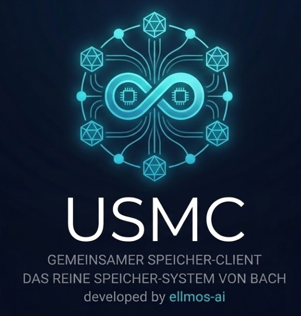

<p align="center">
  
</p>

# USMC -- United Shared Memory Client

**🇬🇧 [English Version](README.md)**

*Die Quelle -- Shared Memory von [ellmos-ai](https://github.com/ellmos-ai).*

**Status: Alpha (v0.1.0)**

Agenten-übergreifende Speicherfreigabe über eigenständiges SQLite. Keine externen Abhängigkeiten.

## Installation

```bash
pip install usmc
```

## Schnellstart

### Client API

```python
from usmc import USMCClient

# Initialize (creates usmc_memory.db)
client = USMCClient(agent_id="my-agent")

# Facts (persistent knowledge)
client.add_fact("project", "framework", "FastAPI", confidence=0.9)
client.add_fact("system", "os", "Windows 11")
facts = client.get_facts(min_confidence=0.8)

# Lessons (learned patterns)
client.add_lesson(
    title="Encoding Bug",
    problem="cp1252 statt UTF-8",
    solution="PYTHONIOENCODING=utf-8 setzen",
    severity="high"
)
lessons = client.get_lessons(severity="high")

# Working memory (session-scoped notes)
client.add_working("Currently refactoring auth module")
working = client.get_working()

# Sessions
session = client.start_session(task="Feature X")
# ... work ...
client.end_session(session['id'], handoff_notes="Refactored auth")

# Context generation (for LLM prompts)
context = client.generate_context()

# Sync (poll-based)
changes = client.get_changes_since("2026-02-28T00:00:00")
```

### High-Level API

Für schnellen, zustandslosen Zugriff ohne Client-Instanzen zu verwalten:

```python
from usmc import api

# Initialize once
api.init(agent_id="opus")

# Facts
api.fact("system", "os", "Windows 11")
api.remember("framework", "FastAPI")  # shortcut with confidence=0.95
facts = api.facts(category="system")

# Working memory
api.note("Aktueller Task: Feature X")
api.scratch("Temporaere Notiz")
api.loop("Iteration 1 von 5")
notes = api.working()
api.clear()  # deactivate all notes

# Lessons
api.lesson("Bug-Title", "Problem", "Solution", severity="high")
lessons = api.lessons()

# Sessions
session = api.start(task="Testing")
api.end(session['id'], notes="Done")

# Context & Status
print(api.context())
print(api.status())
```

### CLI

```bash
# Status
usmc status

# Facts
usmc fact system os "Windows 11"
usmc fact project framework FastAPI --confidence 0.9
usmc facts
usmc facts --category system --json

# Working memory
usmc note "Aktueller Task: Feature implementieren"
usmc note "High priority" --priority 5 --tags "important,urgent"
usmc working
usmc clear

# Lessons
usmc lesson "Encoding Bug" "cp1252 Problem" "PYTHONIOENCODING=utf-8" --severity high
usmc lessons
usmc lessons --severity critical

# Context
usmc context

# Sessions
usmc start --task "Feature X"
usmc end 1 --notes "Done"

# Sync
usmc changes "2026-02-28T00:00:00" --json

# Options
usmc --db custom.db --agent my-agent status
```

## Multi-Agent

Mehrere Agenten können dieselbe Datenbank gemeinsam nutzen:

```python
opus = USMCClient(db_path="shared.db", agent_id="opus")
sonnet = USMCClient(db_path="shared.db", agent_id="sonnet")

opus.add_fact("project", "status", "in-progress", confidence=0.8)
sonnet.add_fact("project", "status", "completed", confidence=0.95)
# Confidence merge: sonnet's higher confidence wins
```

## Funktionen

- Eigenständige SQLite-Datenbank (keine externen Abhängigkeiten)
- Confidence-basierte Konfliktlösung
- Multi-Agent-Unterstützung mit agent_id-Tracking
- Session-Verwaltung mit Übergabenotizen
- Kontextgenerierung für LLM-Prompts
- Änderungsverfolgung über `get_changes_since()`
- High-Level API für schnellen Zugriff
- Vollständige CLI für Terminal-Nutzung
- Null externe Abhängigkeiten (nur stdlib)

## Datenbankschema

- `usmc_facts` -- Persistente Fakten mit Confidence-Scores
- `usmc_working` -- Temporäre Notizen, Kontext, Scratchpad
- `usmc_lessons` -- Gelernte Lektionen mit Schweregrad
- `usmc_sessions` -- Agenten-Session-Tracking

## Herkunft

Entwickelt aus dem SharedMemoryClient-Forschungsprototyp.
Teil des BACH-Ökosystems, aber vollständig eigenständig.

## Siehe auch: OpenClaw

USMC gibt jedem LLM einen Hippocampus -- strukturiertes Langzeitgedächtnis mit Fakten, Lektionen und agenten-übergreifendem Austausch. Wie schneidet es im Vergleich zu [OpenClaw](https://github.com/openclaw/openclaw) (274K+ Stars) ab?

| | **USMC** | **OpenClaw** |
|---|---|---|
| **Fokus** | Persistenter strukturierter Speicher für LLM-Agenten | Vollständiger KI-Assistent mit Messaging-Gateway |
| **Speichermodell** | 4 Tabellen: Facts (Confidence-bewertet), Lessons (Schweregrad), Working Memory, Sessions | Sitzungsbasierter Chat-Verlauf mit `/compact`-Zusammenfassung |
| **Multi-Agent** | Gemeinsame SQLite-DB mit Konfliktlösung (höchste Confidence gewinnt) | Multi-Session mit sitzungsbezogener Isolation |
| **Wissenserhalt** | Permanent -- Fakten und Lektionen bleiben über Sessions und Agenten hinweg erhalten | Flüchtig -- Sitzungsverlauf wird komprimiert oder geht verloren |
| **Abhängigkeiten** | Null -- reines Python stdlib | Node.js 22+, zahlreiche npm-Pakete |
| **Anwendungsfall** | Drop-in-Speicherschicht für jedes LLM-Projekt | Vollständige Assistenten-Plattform |
| **Lizenz** | MIT | MIT |

**Kurzfassung:** OpenClaw verwaltet Konversationen. USMC verwaltet Wissen. Sie ergänzen sich -- USMC kann als Speicher-Backend für jedes Agenten-Framework dienen, einschließlich OpenClaw-ähnlicher Systeme.

## Lizenz

MIT License -- Copyright (c) 2026 Lukas Geiger

## Autor

Lukas Geiger (github.com/lukisch)
